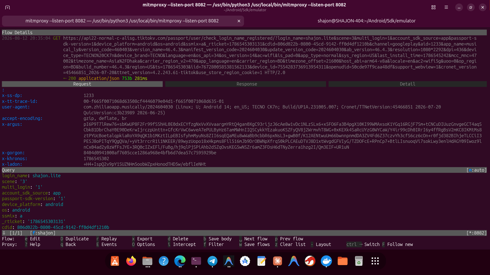
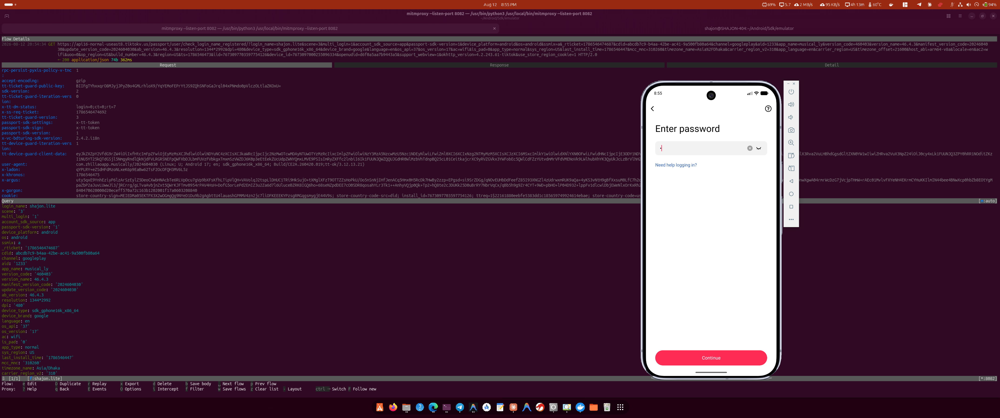

# 🔐 TikTok-SSL-Pinning-Bypass
📡 Intercept TikTok network traffic on Android device

> 💡 **GOOD NEWS:** You do **not** need a rooted device to use this! It works flawlessly on **non-rooted** devices and has been successfully tested using **Mitmproxy** in a non-root environment.

## 📌 Latest Bypassed and Tested App Details
- App version: **46.4.3 (Free Version)**
- Architecture: **arm64-v8a**
- Tools Used for test: [Mitmproxy](https://mitmproxy.org/), [Reqable](https://reqable.com/).
- For any inquiries, please contact me on Telegram [https://t.me/SHAJON](https://t.me/SHAJON)
> ⚠️ **Important Notes:**
> - The `armeabi-v7a` architecture has not been tested yet, so its functionality cannot be guaranteed. Therefore, this APK has not been added to the release either.
> - The `arm64-v8a` patched APK has only been tested on AVD emulators and real Android phones using **mitmweb** and **mitmproxy**. It supports any Android version 6.0+.
> - If you encounter any issues, please open a fully detailed issue on GitHub.
> - This free patched APK does not contain any login errors (specifically, the "**maximum number of attempts reached**" error). Upcoming future versions will also be free from this error.

## 🎥 Evidence



## ✅ Other Apps
1. [TikTok iOS](https://github.com/shajon-dev/iOS-TikTok-SSL-Pinning-Bypass)
2. [Facebook Android](https://github.com/shajon-dev/Facebook-SSL-Pinning-Bypass)
3. [Facebook iOS](https://github.com/shajon-dev/iOS-Facebook-SSL-Pinning-Bypass)
4. [Messenger Android](https://github.com/shajon-dev/Messenger-SSL-Pinning-Bypass)
5. [Messenger iOS](https://github.com/shajon-dev/iOS-Messenger-SSL-Pinning-Bypass)
6. [Instagram Android](https://github.com/shajon-dev/Instagram-SSL-Pinning-Bypass)
7. [Instagram iOS](https://github.com/shajon-dev/iOS-Instagram-SSL-Pinning-Bypass)
8. [Threads Android](https://github.com/shajon-dev/Threads-SSL-Pinning-Bypass)
9. [Threads iOS](https://github.com/shajon-dev/iOS-Threads-SSL-Pinning-Bypass)
10. [Business Suite Android](https://github.com/shajon-dev/Meta-Business-Suit-SSL-Pinning-Bypass)
11. [Business Suite iOS](https://github.com/shajon-dev/iOS-Meta-Business-Suit-SSL-Pinning-Bypass)

## 📦 For Demo - Download Official APKs
  - Read the [setup process](#-setup-process) carefully before use.
  - **Note:** The current version (46.4.3) is provided as a **free version**. For any issues or to request access to **upcoming latest versions**, please [contact me](https://t.me/SHAJON) on Telegram.
<table width="100%">
  <thead>
    <tr>
      <th align="center">Package Name</th>
      <th align="center">Version</th>
      <th align="center">Status</th>
      <th align="center">Non-Root</th>
      <th align="center">Download Link</th>
    </tr>
  </thead>
  <tbody>
    <tr>
      <td align="center"><code>com.zhiliaoapp.musically</code></td>
      <td align="center">46.4.3</td>
      <td align="center">✅ Bypassed</td>
      <td align="center">✅ Yes</td>
      <td align="center"><a href="https://github.com/shajon-dev/TikTok-SSL-Pinning-Bypass/releases">Download Link</a></td>
    </tr>
  </tbody>
</table>

## 📱 Requirements
1. 📱 **No root needed** — runs on real Android phones and Android AVD emulators. **We strongly suggest using ONLY a real Android phone or Android Studio AVD emulator.**
2. 🔎 **Pick the right architecture (ABI).** The provided build is for the **`arm64-v8a`** architecture. Check your device's ABI first (recommended) with the ADB command below to ensure compatibility:
   ```bash
   adb shell getprop ro.product.cpu.abi
   ```
   - 📱 **Real Android phone / AVD Emulator** → should be **`arm64-v8a`**
3. 🔄 Traffic capture tools: [Mitmproxy](https://mitmproxy.org/).

## 🔧 Setup Process
 1. ⬇️ **Download the patched APK** from the [GitHub Releases](https://github.com/SHAJON-404/TikTok-SSL-Pinning-Bypass/releases) page, choosing the file that matches your device architecture (`arm64-v8a`).
 2. 📲 **Install the APK** on your Android device (uninstall the original app first if it is already installed).
 3. 🔄 Configure a proxy and use **mitmproxy** or **mitmweb** to capture and monitor TikTok network traffic.
 4. ✅ **No root required** — this works on non-rooted devices as well.

## 💼 Professional Services & Custom Solutions

Are you looking for the **latest patched APKs** or require specialized technical services? I offer professional, reliable solutions tailored to your needs. 

**My Expertise Includes:**
- 🔐 **SSL Pinning Bypass:** Custom bypass solutions for both Android and iOS applications.
- 🔄 **Reverse Engineering:** Comprehensive analysis and reverse engineering of any Software, Mobile App, or API.
- 🤖 **Bot Development:** Creation of advanced, automated bots for various platforms and customized use cases.

If a specific bypass is not available on my GitHub, or if you have a custom project in mind, let's connect! I am highly active and ready to discuss your requirements.

<p align="left">
  <a href="https://t.me/SHAJON" target="_blank">
    
  </a>
</p>

## ☕ Buy Me a Coffee

If this project helped you, consider **buying me a coffee** — it keeps these bypasses alive and updated! ❤️

| Coin | Network | Address |
| :---: | :--- | :--- |
|  | Binance Pay (UID) | <pre><code>839622149</code></pre> |
|  | TRC20 [TRX Network] | <pre><code>TAsPdCxkX9CeErJ4vw7xBHfZDT6vpdfmwH</code></pre> |
|  | ETH / BSC | <pre><code>0x22d4f314acbf6055b0a37df8df68f9cd40ba889a</code></pre> |
|  | Bitcoin Network | <pre><code>14RYf4pw7v2rtttLxRch2StjFzFAn9ycCE</code></pre> |
